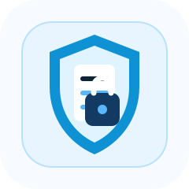
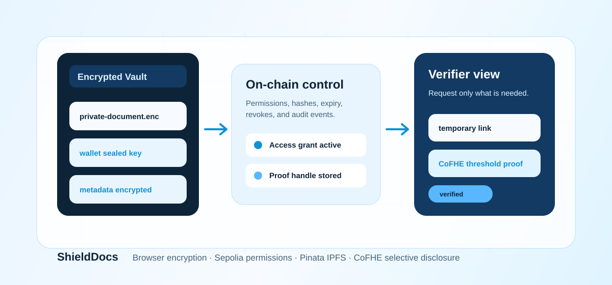
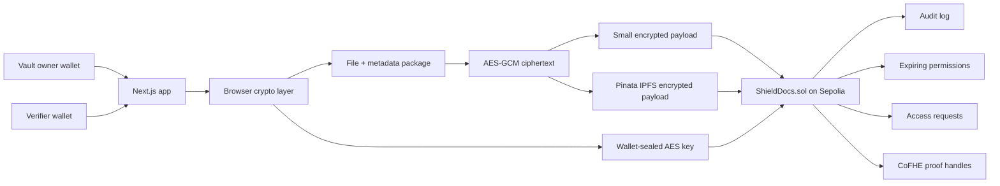

<p align="center">
  
</p>

<h1 align="center">ShieldDocs</h1>

<p align="center">
  Privacy-first encrypted document vault with wallet-controlled sharing, on-chain audit history, Pinata IPFS storage, and CoFHE selective disclosure.
</p>

<p align="center">
  <a href="https://shielddocs-three.vercel.app">Live App</a>
  ·
  <a href="https://sepolia.etherscan.io/address/0x6Af3D1F1B1c7E23852373D82e02E03091FdbDe0E">Sepolia Vault Contract</a>
  ·
  <a href="https://sepolia.etherscan.io/address/0x0f78Ab920C0D715968F578e5559cA05371619986">Attestation Contract</a>
</p>



## Status

ShieldDocs is fully ready and working for the shipped Sepolia testnet release. The frontend is deployed on Vercel, the app points to the current Sepolia vault and attestation contracts, the ABI matches the compiled artifacts, deployed bytecode matches the local vault artifact, and the shipped document flows have been verified locally and smoke-tested on production.

Current production targets:

```text
Live app:          https://shielddocs-three.vercel.app
Vault contract:    0x6Af3D1F1B1c7E23852373D82e02E03091FdbDe0E
Attestations:      0x0f78Ab920C0D715968F578e5559cA05371619986
Deployment block:  10941062
```

This release is ready for Wavehack judging, demos, and Sepolia user testing. Before storing real high-value legal, medical, identity, or financial documents at scale, complete external source verification, durable backend rate-limit storage, wallet-automated e2e tests, and a formal security review.

## What Is ShieldDocs?

ShieldDocs is a privacy-first document vault for sensitive files such as identity documents, legal records, medical reports, educational certificates, tax files, financial records, compliance paperwork, and private agreements.

The core idea is simple:

- Plaintext stays local in the browser.
- Documents are encrypted before chain or IPFS storage.
- The chain stores ciphertext integrity, ownership, permissions, revokes, and audit events.
- Owners can grant temporary access to another wallet.
- Verifiers can request scoped access instead of asking users to overshare full files.
- CoFHE powers selective disclosure, such as proving an encrypted age threshold without publishing the raw input.

## What The App Does

- Creates wallet-owned encrypted document vaults.
- Encrypts files locally with AES-GCM.
- Packages real title, category, filename, and MIME type inside the encrypted payload for new uploads.
- Stores small ciphertexts directly on chain.
- Stores larger ciphertexts on Pinata IPFS with the `ipfs://` reference and hash on chain.
- Uses EIP-712 typed-data authorization before creating Pinata signed upload URLs.
- Seals AES document keys to wallet encryption public keys.
- Lets owners decrypt and download their own files.
- Lets owners share temporary access with another wallet.
- Lets recipients decrypt shared files only while permission is active.
- Lets owners revoke permissions.
- Lets owners rotate/re-encrypt document payloads after revocation.
- Lets requesters ask for document access through an on-chain request flow.
- Lets owners approve, deny, or leave requests pending.
- Lets requesters cancel pending requests.
- Records uploads, requests, approvals, denials, revokes, access use, proof creation, and proof views in the audit trail.
- Creates CoFHE encrypted age-threshold proofs.
- Records trusted issuer-signed age attestations for production-style credential claims.
- Rebuilds requestable document cards and proof history from contract events.
- Provides a polished responsive UI with overview, vault, upload, sharing, requests, verify, audit, shared-link, and roadmap routes.

## Why It Matters

Most document workflows still ask users to upload complete private files into centralized systems. That is risky because people often only need to prove a narrow fact:

- A bank may need income eligibility, not full statements.
- A venue may need age eligibility, not a full ID.
- An employer may need credential validity, not every private record.
- A hospital may need temporary emergency access, not permanent file ownership.

ShieldDocs is built around controlled disclosure. Users keep documents encrypted, owners decide who gets access, revocation is on chain, and verifiers can move toward proof-based checks instead of collecting unnecessary data.

## User Roles

### Vault Owner

The owner uploads encrypted documents, downloads them locally, manages permissions, revokes access, rotates keys, and reviews audit history.

### Requester / Verifier

The verifier loads a wallet encryption public key, discovers requestable document IDs, requests scoped access, receives a permission link when approved, and decrypts only if the owner granted file access.

### Shared Recipient

The recipient opens `/share/[permissionId]`, connects the grantee wallet, reads the active permission, fetches ciphertext from chain or IPFS, verifies the hash, decrypts the sealed key through the wallet, and downloads the plaintext locally.

### Selective Disclosure Viewer

The proof viewer reads a CoFHE proof handle and decrypts the boolean result through a permit if the contract granted access.

## Main Flows

### Upload

1. User connects wallet.
2. User selects a file and enters local metadata.
3. Browser packages the file with metadata.
4. Browser generates an AES-GCM key and IV.
5. Browser encrypts the packaged payload.
6. Wallet provides an encryption public key with `eth_getEncryptionPublicKey`.
7. Browser seals the AES key to the wallet.
8. Small ciphertext goes on chain; larger ciphertext goes to Pinata IPFS.
9. Contract stores storage mode, hash, IV, generic public metadata, and owner key envelope.

### Share

1. Owner selects a document.
2. Owner enters recipient address, recipient encryption public key, scope, and expiry.
3. Browser decrypts the owner key envelope locally.
4. Browser re-seals the AES key to the recipient.
5. Contract writes an expiring permission.
6. Recipient opens the permission link and decrypts while permission is active.

### Revoke And Rotate

1. Owner revokes a permission on chain.
2. Contract clears the active permission key envelope.
3. Owner can rotate the document key.
4. Browser decrypts the current payload locally.
5. Browser generates a fresh AES key, re-encrypts the payload, and updates hash/storage reference on chain.

### Request Access

1. Requester loads wallet encryption public key.
2. Requester selects a discovered document or enters an ID.
3. Requester submits reason, scope, and public key on chain.
4. Owner approves or denies.
5. Requester can cancel pending requests.
6. Approved requests produce permission links.

### Selective Disclosure

1. Owner chooses a document.
2. Owner enters a private age input and threshold.
3. CoFHE encrypts the input.
4. Contract computes `FHE.gte(encryptedAge, threshold)`.
5. Contract grants proof access to owner and verifier.
6. UI decrypts the boolean proof result through a CoFHE permit.

## Architecture



Trust boundaries:

- The browser handles plaintext and local encryption.
- The wallet handles key unsealing through wallet encryption APIs.
- Sepolia stores public contract state, ciphertext, hashes, permissions, and events.
- Pinata stores encrypted blobs only.
- CoFHE handles encrypted comparison and proof viewing.

## Contract Design

Main contract:

```text
contracts/ShieldDocs.sol
```

The contract includes:

- Vault creation.
- Document creation and update.
- On-chain and IPFS storage modes.
- Payload hash integrity.
- Owner-only full document reads.
- Shared document reads for active grantees.
- Request creation, approval, denial, and cancellation.
- Direct access grants.
- Permission expiry and revocation.
- Key-envelope clearing on revoke.
- Document archive.
- Per-document audit logs.
- CoFHE encrypted age proof creation.
- CoFHE proof viewer grants.
- Event-backed document discovery.
- Event-backed proof history.
- Field length caps and payload validation.
- Zero-IV and zero-hash rejection.

Contract size after hardening:

```text
deployed bytecode: 22,932 bytes
EIP-170 limit:     24,576 bytes
remaining room:     1,644 bytes
```

## Frontend Design

The frontend is a Next.js App Router app with Tailwind CSS. The final UI pass added:

- Product-focused homepage with a clear value proposition.
- Animated encrypted workflow panel.
- Feature overview for vault, sharing, key rotation, and proofs.
- End-to-end workflow section.
- Owner, verifier, and demo use-case cards.
- Footer with secondary navigation.
- Roadmap removed from the main navbar.
- Mobile-friendly network switching.
- Copy buttons for public keys and permission links.
- Clear status messages for upload, decrypt, grant, revoke, rotate, request, proof, and audit actions.

## Implemented Routes

| Route | Purpose |
| --- | --- |
| `/` | Product overview, live vault status, feature explanation |
| `/vault` | Owned document list, decrypt download, archive, key rotation |
| `/vault/upload` | Local encryption, wallet key load, on-chain/IPFS upload |
| `/sharing` | Direct grants, permission links, revoke controls |
| `/requests` | Requester flow, owner approval/deny flow, cancellation |
| `/verify` | CoFHE encrypted age-threshold proof creation and viewing |
| `/audit` | Owner-readable document audit activity |
| `/share/[permissionId]` | Recipient shared document decrypt page |
| `/roadmap` | Shipped scope and next hardening notes |

## Tech Stack

- Next.js App Router
- React
- Tailwind CSS
- wagmi
- viem
- Solidity
- Hardhat
- CoFHE SDK
- `@fhenixprotocol/cofhe-contracts`
- Pinata IPFS
- TUS resumable uploads
- MetaMask wallet encryption APIs
- Vercel

## Project Structure

```text
contracts/ShieldDocs.sol              Main smart contract
scripts/deploy.ts                     Deployment script
scripts/export-abi.ts                 ABI/bytecode export
deployments/sepolia.json              Current Sepolia deployment metadata
src/app                               Next.js App Router pages
src/app/api/pinata/sign               Pinata signed upload URL endpoint
src/components                        Shared UI components
src/hooks/useShieldDocs.ts            Contract read hooks and event discovery
src/lib/contract.ts                   Contract address, ABI, labels, constants
src/lib/crypto.ts                     Encryption, packaging, wallet key envelopes
src/lib/ipfs.ts                       Pinata upload and IPFS fetch helpers
src/lib/cofhe.ts                      CoFHE browser helpers
src/lib/wagmi.ts                      Chain and wallet configuration
test/ShieldDocs.ts                    Contract and CoFHE mock tests
public/shielddocs-logo.svg            README/app logo asset
public/shielddocs-readme-hero.svg     README architecture banner
```

## Deployment

Sepolia:

```text
network:          sepolia
chainId:          11155111
address:          0x7B12e2BDc1966978dc4b87Cbff24d96e7B900D47
deploymentBlock:  10939963
transactionHash:  0x7e602e008910919908d1be6f2a8bdb2974a5eccb172be1309a6b257c5dbe3674
```

Vercel production:

```text
https://shielddocs-three.vercel.app
```

Production env values:

```text
NEXT_PUBLIC_SHIELDDOCS_ADDRESS=0x7B12e2BDc1966978dc4b87Cbff24d96e7B900D47
NEXT_PUBLIC_SHIELDDOCS_CHAIN_ID=11155111
NEXT_PUBLIC_SHIELDDOCS_DEPLOYMENT_BLOCK=10939963
NEXT_PUBLIC_DISCOVERY_FROM_BLOCK=10939963
NEXT_PUBLIC_PROOF_HISTORY_FROM_BLOCK=10939963
PINATA_JWT=<server-only secret>
PINATA_MAX_UPLOAD_BYTES=1073741824
NEXT_PUBLIC_PINATA_MAX_UPLOAD_BYTES=1073741824
NEXT_PUBLIC_PINATA_GATEWAY_URL=https://gateway.pinata.cloud
```

## Local Development

Install and verify:

```powershell
npm install
npm run compile
npm run export:abi
npm test
npm run build
```

Run local chain:

```powershell
npx hardhat node
```

Deploy locally:

```powershell
npm run deploy:local
```

Run frontend:

```powershell
npm run dev -- -p 3001
```

Open:

```text
http://localhost:3001
```

## Testnet Deployment

```powershell
$env:PRIVATE_KEY="YOUR_TESTNET_PRIVATE_KEY"
npm run deploy:sepolia
Remove-Item Env:PRIVATE_KEY
npm run export:abi
npm run build
```

Deployment writes:

- `deployments/<network>.json`
- `.env.local` with contract address, chain ID, deployment block, discovery block, and proof-history block

Keep `.env.local`, `.env`, private keys, RPC secrets, Pinata tokens, and Vercel tokens out of source control.

## Verification

Latest verification completed:

- `npm run lint`
- `npm run typecheck`
- `npm test` with 12 passing contract/CoFHE mock tests
- `npm run build`
- `npm audit --audit-level=high`
- ABI/bytecode export check
- Sepolia deployed bytecode match check
- Vercel production deployment
- Live route smoke checks
- Live homepage check for the new contract address

Test coverage includes:

- Document creation.
- Owner access control.
- Unauthorized read blocking.
- Request approval.
- Request cancellation.
- Permission expiry.
- Permission revocation.
- Shared document reads.
- Verify-only scoped requests withholding payload/key material.
- IPFS storage mode creation.
- Audit restrictions.
- CoFHE age proof creation.
- Payload size rejection.
- Input length caps.
- Zero-hash and zero-IV rejection.
- Event-backed request discovery.
- Event-backed proof history.

## Security Model

What ShieldDocs protects:

- Plaintext files are encrypted before storage.
- Real file metadata is encrypted inside new upload payloads.
- On-chain hashes detect encrypted payload mismatch.
- Shared recipients receive only the grantee key envelope, not the owner envelope.
- Revoked permissions cannot read shared documents through the contract.
- Rotated payloads cannot be opened with old shared key envelopes.
- Verify-only permissions do not disclose file payloads or key envelopes.

Important limitations:

- Public chains and public IPFS expose ciphertext and metadata that is intentionally stored on chain.
- Revocation cannot erase plaintext or keys a recipient already copied before revocation.
- The current age proof is based on a user-provided encrypted input; production credential claims should use signed issuers or trusted attestations.
- Wallet encryption support depends on wallets that implement `eth_getEncryptionPublicKey` and `eth_decrypt`.
- Durable production rate limiting should use Redis/KV instead of only in-memory server state.
- A formal third-party audit is still required before real sensitive document custody.

## Final Shipped Work

- Hardened Sepolia smart contract deployed and connected to production.
- Vercel production redeployed and aliased to the live app URL.
- Metadata privacy improved for new uploads.
- EIP-712 upload authorization added.
- Contract validation tightened.
- Request cancellation shipped.
- Permission copy/public-key copy actions shipped.
- Shared access audit ordering fixed.
- Homepage redesigned with product story, animation, architecture-like flow, and CTA sections.
- Footer added across the app.
- Roadmap removed from the primary navbar.
- README upgraded with logo, visual banner, architecture, flows, deployment, verification, and security details.

## Next External Hardening

- Verify source on Sepolia Etherscan with `ETHERSCAN_API_KEY`.
- Move upload nonce/rate-limit storage to Redis/KV.
- Add wallet-automated e2e tests for the full app.
- Add more CoFHE proof templates: income range, credential validity, residency, membership, document freshness, and score threshold.
- Add notification/indexer service for requests, approvals, expiries, revokes, and proof views.
- Complete a formal security audit before using real sensitive documents.

## Docs Used

- CoFHE Client SDK overview: https://cofhe-docs.fhenix.zone/client-sdk/introduction/overview
- CoFHE Hardhat quick start: https://cofhe-docs.fhenix.zone/client-sdk/quick-start/hardhat
- FHE.sol overview: https://cofhe-docs.fhenix.zone/fhe-library/reference/fhe-sol/overview
- FHE access control: https://cofhe-docs.fhenix.zone/fhe-library/core-concepts/access-control
- Pinata upload endpoint: https://docs.pinata.cloud/api-reference/endpoint/upload-a-file
- Pinata presigned URLs: https://docs.pinata.cloud/files/presigned-urls
